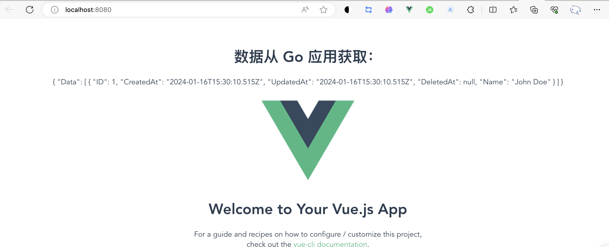

### docker-compose.yml 内容

```
version: '3.8'

services:
  vue-app:
    build: ./meetyou
    ports:
      - "8080:8080"
    volumes:
      - ./meetyou:/app
      - /app/node_modules
    environment:
      - CHOKIDAR_USEPOLLING=true

  go-app:
    build: ./meetgo
    ports:
      - "8081:8080"
    depends_on:
      - db
    environment:
      - DB_HOST=db
      - DB_USER=root
      - DB_PASSWORD=123456
      - DB_NAME=meetyou

  db:
    image: mysql:5.7
    ports:
      - "3306:3306"
    environment:
      - MYSQL_ROOT_PASSWORD=123456
      - MYSQL_DATABASE=meetyou
      - MYSQL_USER=root
    volumes:
      - db-data:/var/lib/mysql
    restart: always

volumes:
  db-data:

networks:
  default:
    driver: bridge
```

### 详细说明

1. **vue-app**:

   - 构建路径为 `./meetyou`。
   - 将容器的 8080 端口映射到主机的 8080 端口。
   - 卷映射以保留 `node_modules` 和源代码的同步。
   - 设置环境变量 `CHOKIDAR_USEPOLLING` 为 `true`，这对于某些开发环境中的文件监听很有用。

2. **go-app**:

   - 构建路径为 `./meetgo`。
   - 将容器的 8080 端口映射到主机的 8081 端口。
   - 通过 `depends_on` 确保在数据库服务启动后再启动此服务。
   - 设置环境变量来配置数据库连接。

3. **db** (MySQL 数据库):

   - 使用 `mysql:5.7` 镜像。
   - 将容器的 3306 端口映射到主机的 3306 端口。
   - 设置环境变量以配置 MySQL 服务（包括根密码和数据库名称）。
   - 使用卷 `db-data` 进行数据持久化。
   - 设置 `restart: always` 确保数据库服务在退出时自动重启。

4. **网络**:
   - 使用默认的桥接网络。

使用此 `docker-compose.yml` 文件，您可以通过运行 `docker-compose up` 命令来启动所有服务。如果要在后台运行这些服务，请使用 `docker-compose up -d` 命令。在进行任何操作之前，请确保 `Dockerfile` 位于相应的 `meetgo` 和 `meetyou` 目录中，并且它们符合您项目的构建需求。

当您运行 "docker-compose build --no-cache","docker-compose up --build" 后，vue-app、go-app 和 db 服务将被创建并启动。您可以通过访问 http://localhost:8080 来访问 Vue 应用，通过 http://localhost:8081 来访问 Go 应用。


